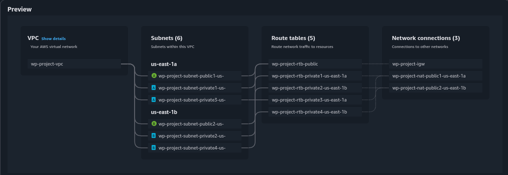

# High-Availabilty WordPress AWS Hosting System

## About the Project

This project consists on implementing a scalable infrastructure to host WordPress applications on AWS. The solution involves the installation and configuration of Docker on two EC2 instances, using a startup script (`user_data.sh`) to automate the process. Additionally, the project includes setting up a MySQL database managed by Amazon RDS, integrating Amazon EFS for sharing static files between the EC2 instances hosting WordPress, and deploying an Application Load Balancer to distribute traffic across instances in multiple Availability Zones, ensuring high availability. The EC2 instances are managed by an Auto Scaling Group, which automatically adjusts capacity based on demand, ensuring the application scales efficiently and remains available even during traffic spikes.

### Table of Contents

1. [Prerequisites](#1-prerequisites)
2. [Virtual Environment Configuration](#2-virtual-environment-configuration)
    - 2.1 [Resource Configuration](#21-resource-configuration)
    - 2.2 [VPC Creation](#22-vpc-creation)

## 1. Prerequisites

- An active AWS account
- Basic knowledge of the AWS console
- Basic Linux terminal knowledge
- Familiarity with containerization concepts

## 2. Virtual Environment Configuration 

Before we create the EC2 instances that will host the WordPress applications and configure the other security, storage, and load balancing services, we need to set up the network environment where the project will run. We will create a VPC (Virtual Private Cloud) dedicated to the project.

> [!NOTE]
> AWS offers two options for VPC creation: manual and automatic. In manual creation, you configure the VPC, subnets, routers, gateways, and other network options customly. In the automatic option, the **VPC wizard** creates the VPC with public and private subnets, attaches an internet gateway, configures route tables, and includes a NAT gateway if necessary. We'll use automatic creation with the VPC wizard.

### 2.1 Resource Configuration

1. In the AWS console, access the VPC service and click "**Create VPC**".

2. In "**VPC Settings**", select "**VPC and more**".

3. In "**Name tag auto-generation**", keep it checked to generate names automatically.

4. In the input field, enter the tag you want to use as a prefix for the resources that will be created.

5. Configure the resources:

    - VPC CIDR: 10.0.0.0/16 
    - Number of Availability Zones (AZs): 2
    - Number of public subnets: 2
    - Number of private subnets: 4
    - NAT Gateway: 1 per AZ 
    - VPC endpoints: None

6. Optionally, add descriptive tags to the VPC. This helps easily identify resources associated with the project.

## 2.2 VPC Creation

1. Click "**Create VPC**" and wait for the resources to be created.

2. The wizard will automatically create:

    - A VPC with DNS hostnames enabled
    - Two public subnets, one in each selected Availability Zone (AZ)
    - Two private subnets, one in each selected AZ, for application servers and database storage
    - An Internet Gateway (IGW) attached to the VPC 
    - Two NAT Gateways, one in each public subnet, for outbound internet access from the private subnets
    - Route tables configured for:

        - Public subnets with routes to the Internet Gateway
        - Private subnets with routes to their respective NAT Gateway

    - A default security group

#### VPC Workflow Preview

