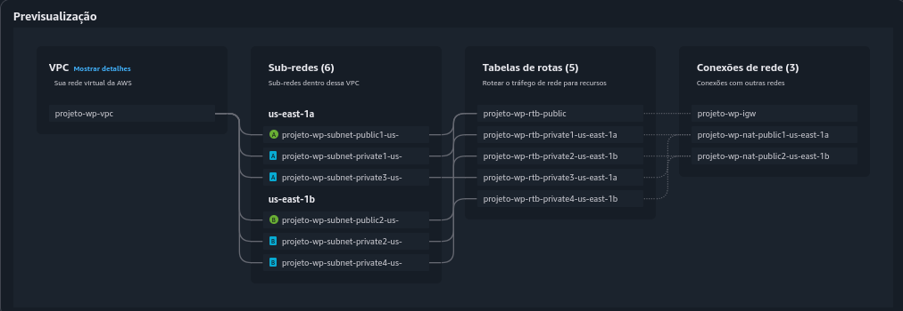

# Sistema de Alta Disponibilidade de Hospedagem do WordPress

## Sobre o Projeto

Este projeto consiste na implementação de uma infraestrutura escalável para hospedar aplicações WordPress na AWS. A solução envolve a instalação e configuração do Docker em instâncias EC2, utilizando um script de inicialização (`user_data.sh`) para automatizar o processo. Além disso, o projeto inclui a configuração de um banco de dados MySQL gerenciado pelo Amazon RDS, a integração do Amazon EFS para o compartilhamento de arquivos estáticos entre as instâncias EC2 que hospedam o WordPress e a implementação de um Application Load Balancer para distribuir o tráfego entre instâncias em múltiplas Zonas de Disponibilidade, garantindo alta disponibilidade. As instâncias EC2 são gerenciadas por um Auto Scaling Group, que ajusta automaticamente a capacidade com base na demanda, assegurando que a aplicação escale de forma eficiente e permaneça disponível mesmo em picos de tráfego.

### Índice

1. [Pré-requisitos](#1-pré-requisitos)
2. [Configuração do Ambiente Virtual](#2-configuração-do-ambiente-virtual)
    - 2.1 [Configuração dos Recursos](#21-configuração-dos-recursos)
    - 2.2 [Criação da VPC](#22-criação-da-vpc)

## 1. Pré-requisitos

- Uma conta ativa na AWS
- Conhecimento básico do console AWS
- Conhecimento básico do terminal Linux
- Familiaridade com conceitos de conteinerização

## 2. Configuração do Ambiente Virtual 

Antes de criarmos as instâncias EC2 que hospedarão as aplicações do WordPress e configurar os demais serviços de segurança, armazenamento e balanceamento de carga, precisamos configurar o ambiente de rede onde o projeto será executado. Criaremos uma VPC (Virtual Private Cloud) dedicada ao projeto.

> [!NOTE]
> A AWS oferece duas opções para criação de VPC: manual e automática. Na criação manual,  você configura a VPC, sub-redes, roteadores, gateways e outras opções de rede de forma  personalizada. Já na opção automática, o **assistente de VPC** cria a VPC com sub-redes públicas e  privadas, já anexa um gateway de internet, configura as tabelas de rotas e inclui um gateway NAT, caso seja necessário. Utilizaremos a criação automática com o VPC wizard. 

### 2.1 Configuração dos Recursos
 
1. No console AWS, acesse o serviço VPC e clique em "**Criar VPC**".

2. Em "**Configurações da VPC**" selecione "**VPC e muito mais**"

3. Em "**Geração automática de etiqueta de nome**", deixe marcado para gerar os nomes automaticamente.

4. No campo de entrada, digite a etiqueta que deseja utilizar como prefixo para o nome dos recursos que serão criados.

5. Configure os recursos:

    - CIDR da VPC: 10.0.0.0/16
    - Número de zonas de disponibilidade (AZs): 2
    - Número de sub-redes públicas: 2
    - Número de sub-redes privadas: 4 
    - Gateway NAT: 1 por AZ
    - VPC endpoints: Nenhuma 

6. Opcionalmente, adicione tags descritivas à VPC. Isso ajuda a identificar facilmente os recursos associados ao projeto.

## 2.2 Criação da VPC 

1. Clique em "**Criar VPC**" e aguarde a criação dos recursos.

2. O assistente criará automaticamente:

    - Uma VPC com DNS hostnames habilitados
    - Duas sub-redes públicas, um em cada Zona de Disponibilidade (AZ) selecionada
    - Duas sub-redes privadas, um em cada AZ selecionada, para os servidores de aplicação e armazenamento do banco de dados
    - Um Internet Gateway (IGW) anexado à VPC 
    - Dois NAT Gateways, um em cada sub-rede pública, para permitir acesso à internet para as sub-redes privadas
    - Tabelas de rota configuradas para:

        - sub-redes públicas com rotas para o Internet Gateway
        - sub-redes privadas com rotas para os respectivos NAT Gateways

    - Um grupo de segurança padrão

    #### Preview do VPC Workflow

    
