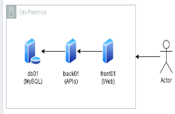

# **AWS Migration & Modernization: Lift-and-Shift to Kubernetes with AWS MGN and DMS**

## About the Project

**Fast Engineering S/A** is in the process of modernizing its eCommerce infrastructure with a migration to AWS. The current system can no longer handle the high traffic and volume of purchases, so the company is taking a two-phase approach:

1. **Lift-and-Shift Migration (as-is):** In this initial phase, the focus is on quickly moving the systems to AWS without major architectural changes, ensuring that the infrastructure can immediately meet growing demand. To accomplish this, **AWS MGN (Application Migration Service)** will be used for server migration, while **AWS DMS (Database Migration Service)** will handle the database migration efficiently and with minimal downtime.

2. **Modernization to Kubernetes:** Once the migration is complete, the infrastructure will be updated to a Kubernetes-based environment using **Amazon EKS (Elastic Kubernetes Service)**. EKS offers a fully managed solution for running Kubernetes clusters, enabling enhanced scalability, availability, and easier management.

The new architecture is designed with the following key principles in mind:

- A **Kubernetes environment** for efficient container management.
- A **managed database** (PaaS, Multi-AZ) to ensure high availability and scalability.
- **Data backups** for protection and recovery.
- An **object storage system** (for assets like images, videos, etc.) for scalable and durable storage.
- Enhanced **security** measures to protect both data and infrastructure.

### Table of Contents

1. [Current Architecture](#1-current-architecture)
    - 1.1 [Architecture Overview](#11-architecture-overview)
    - 1.2 [Server Infrastructure](#12-server-infrastructure)
    - 1.3 [Current Architecture Diagram](#13-current-architecture-diagram)
2. [Lift-and-Shift (As-Is) Migration](#2-lift-and-shift-as-is-migration)  
    - 2.1 [Database Server Migration with DMS](#21-database-server-migration-with-dms)  
    - 2.2 [Application Server Migration with MGN](#22-application-server-migration-with-mgn)  
    - 2.3 [Services Used](#23-services-used)  
    - 2.4 [Migration Cost](#24-migration-cost)  
    - 2.5 [Post-Migration Infrastructure Cost](#25-post-migration-infrastructure-cost)  
    - 2.6 [Post-Migration Architecture Diagram](#26-post-migration-architecture-diagram)  
3. [Architecture Modernization to Kubernetes](#3-architecture-modernization-to-kubernetes)  
    - 3.1 [Infrastructure Setup](#31-infrastructure-setup)  
    - 3.2 [EKS Cluster Deployment](#32-eks-cluster-deployment)  
      - 3.2.1 [Worker Node Configuration](#321-worker-node-configuration)  
      - 3.2.2 [Pod Storage Configuration](#322-pod-storage-configuration)  
      - 3.2.3 [Ingress and AWS Load Balancer Controller Configuration](#323-ingress-and-aws-load-balancer-controller-configuration)  
    - 3.3 [Application Containerization](#33-application-containerization)  
    - 3.4 [CI/CD Pipeline Setup](#34-cicd-pipeline-setup)  
    - 3.5 [Integration with Existing Services](#35-integration-with-existing-services)  
    - 3.6 [Post-Modernization Infrastructure Cost](#36-post-modernization-infrastructure-cost)  
    - 3.7 [Post-Modernization Architecture Diagram](#37-post-modernization-architecture-diagram)  
4. [Conclusion](#4-conclusion)  
5. [References](#5-references)

## 1. Current Architecture

### 1.1 Architecture Overview
The current system uses a three-tier architecture with separate servers for database, frontend, and backend functions. Nginx on the backend server acts as a load balancer for the three APIs and serves static content, while the React frontend and MySQL database operate on dedicated servers.

## 1.2 Server Infrastructure

### Database Server

- **Purpose**: MySQL Database Server
- **Storage**: 500GB of data
- **Memory**: 10GB RAM
- **Processing**: 3 CPU Cores

### Frontend Server

- **Purpose**: React Application
- **Storage**: 5GB of data
- **Memory**: 2GB RAM
- **Processing**: 1 CPU Core

### Backend Server

- **Purpose**: Backend APIs with Nginx Load Balancer
- **Components**:
  - 3 APIs
  - Nginx 
  - Static file storage
- **Storage**: 5GB of data
- **Memory**: 4GB RAM
- **Processing**: 2 CPU Cores

## 1.3 Current Architecture Diagram

## 2. Lift-and-Shift Migration (As-Is)

### 2.1 Database Server Migration with DMS

In this first phase, we use **AWS Database Migration Service (DMS)** to migrate the MySQL database from the on-premises environment to AWS, using the **serverless** migration option. The serverless option eliminates the need to manually manage replication instances, automatically adjusting capacity as needed during the migration. In this migration model, costs are only incurred for the resources actually used during the process, which optimizes expenses without the need to size or manage the infrastructure.

#### Source and Target Endpoint Configuration

The first step is to configure the endpoints in serverless AWS DMS:

* **Source endpoint configuration:** We set the on-premises MySQL database as the source, providing the required connection details.
* **Network access configuration:** A VPN is implemented to establish a secure connection between the on-premises environment and AWS.
* **Target endpoint configuration:** We define Amazon RDS for MySQL as the migration target.

#### Creating the Serverless Replication

After configuring the endpoints, we proceed to set up the serverless replication:

* **Capacity definition:** We configure the minimum and maximum capacity units (DCUs) that DMS can automatically provision based on demand.
* **Auto-scaling setup:** We leverage DMS’s serverless capability to automatically manage resource provisioning.
* **Replication parameters configuration:** We fine-tune specific settings to ensure an efficient and reliable migration.

#### Replication Execution

With replication configured, we start the migration process:

* **Metadata collection:** DMS connects to the source database and gathers the necessary metadata.
* **Automatic provisioning:** The service provisions the required capacity for replication as defined in the configuration.
* **Scaling monitoring:** We monitor how DMS automatically adjusts resources based on the migration workload.

#### Validation Tests

After the migration is complete, we run tests:

* **Data integrity verification:** We compare data between source and target to ensure correct transfer.
* **Performance testing:** We run queries to assess the response time of the migrated database.

### 2.2 Application Server Migration with MGN

In this second phase, we use **Application Migration Service (MGN)** to migrate the on-premises servers to AWS with minimal downtime, without significant changes to the infrastructure.

#### Source Servers

The first step is installing a **replication agent** on the on-premises servers. For this, we create an IAM user in AWS with the necessary permissions to interact with AWS resources and allow data replication from the source servers to the cloud.

#### Replication Servers

In this step, replication servers are automatically provisioned by AWS MGN based on a replication configuration template. In our case, the Replication Settings Template defines the necessary parameters, including the private subnet, internet access via NAT Gateway, and firewall rules for connectivity with the on-premises servers. These servers are responsible for temporarily storing and processing data from the on-premises servers before sending it to the **staging area**.

#### Staging Area

Once data is replicated to the replication server, it is sent to the staging area on AWS, which in our case consists of an EBS volume. In this area, the data is temporarily stored and prepared for final conversion. During this process, checks are performed, such as:

* validation of replicated data integrity,
* consistency checks between the on-premises data and the staging data,
* and necessary configuration adjustments (e.g., directory paths, network parameters, permissions, or other software-specific settings).

Additionally, performance tests are carried out to ensure the AWS infrastructure can handle the data volume. Once validated and adjusted, the data is ready to be transformed into EC2 instances in AWS.

#### Conversion and Launch of EC2 Instances

After data in the staging area is validated and prepared, it is converted into EC2 instances in AWS. This process transforms the EBS volumes containing the replicated data into storage volumes attached to EC2 instances configured according to environment needs. The EC2 instances are then configured with the required infrastructure, including:

* **Network configuration:** Instances are placed in private subnets with defined security rules in security groups and Network ACLs.
* **Load balancing:** An **Application Load Balancer** is set up to efficiently distribute traffic among the EC2 instances, ensuring high availability.
* **Auto Scaling:** The EC2 instances are configured in an **Auto Scaling Group** to allow automatic scaling based on traffic demand.

#### Testing

At this stage, we run tests to ensure everything is functioning correctly. The migrated instances are tested in a pre-production AWS environment, without affecting the original production environment. This allows us to verify data functionality and accessibility, and identify and fix any issues. The following tests are performed:

* **Data verification:** Ensure data was replicated correctly and is properly accessible.
* **Performance validation:** Evaluate the performance of the EC2 instances in AWS and compare it with the on-premises environment to ensure capacity requirements are met.
* **Application tests:** Validate that applications are functioning as expected (e.g., frontend communicates with backend, APIs are operational, etc.).
* **Integration tests:** Verify that different system components (e.g., backend, database, load balancer) are working properly together.

#### Cutover

The **cutover** is the final step, where the AWS infrastructure is officially moved to production. After successful testing, the migration is finalized and the local production environment is decommissioned in favor of the new cloud environment. To ensure consistency and minimize downtime, the database and application cutover is carried out in a coordinated manner. This involves:

* **Shutting down local systems:** After final validation, the on-premises servers are shut down to prevent further writes to the database.
* **Finalizing DMS replication:** DMS applies all pending changes to the AWS database, ensuring it is fully synchronized with the on-premises database.
* **Redirecting applications:** Migrated applications in AWS are configured to point to the database in AWS.
* **DNS reconfiguration and traffic redirection:** DNS is updated (via Route 53) to point to the AWS infrastructure instead of the on-premises one.
* **Post-cutover monitoring:** A monitoring period follows the cutover to ensure the AWS environment is working as expected and to detect any early issues.

At this point, the lift-and-shift process is complete, and the instances are running in the cloud with the supporting infrastructure configured to ensure high availability, scalability, and security.

### 2.3 Services Used

During the migration, in addition to the essential cloud infrastructure (VPC, Security Groups, and other resources) and the application (MGN) and database (DMS) migration services, we used several other services to ensure an efficient, secure, and scalable solution. The main services used in the process were:

#### Route 53

Used for DNS management, enabling traffic redirection to the new instances and services in AWS, ensuring a scalable traffic routing solution.

#### CloudFront

Implemented as a **Content Delivery Network (CDN)**, CloudFront ensures fast and global delivery of static content (such as images, CSS, and JavaScript) stored in S3 buckets. It uses AWS **edge locations** to cache content closer to end-users, reducing latency and improving user experience. In addition, CloudFront is integrated with **WAF (Web Application Firewall)** to protect the application against common web attacks such as **SQL injection**, **cross-site scripting (XSS)**, and **DDoS**, ensuring security and optimized performance.

#### S3 (Simple Storage Service)

Used for storing static data such as images, videos, and backups. S3 provides durability, scalability, and data availability. Combined with CloudFront, S3 acts as the origin for caching static content, enabling fast and global delivery of these files through AWS edge locations. This combination reduces latency and decreases the load on application servers.

#### S3 Gateway Endpoint

The S3 Gateway Endpoint enables private communication between the VPC and S3 without using the public internet, ensuring more secure connections between instances in private subnets and S3 buckets. Additionally, since the communication occurs directly over the AWS network, latency is significantly reduced.

#### Application Load Balancer (ALB)

The ALB, with support for **path-based routing**, acts as the entry point for dynamic traffic, allowing requests to be routed to different EC2 instance groups based on the URL path. If a request reaches CloudFront and is not for static content (e.g., APIs or dynamic application routes), CloudFront forwards the request to the ALB. The ALB then uses **cross-zone load balancing** to efficiently distribute traffic across EC2 instances in multiple availability zones, ensuring high availability and scalability.

#### NAT Gateway

Used to allow instances in private subnets to access the internet (for package updates, log shipping, etc.).

#### Network ACLs (NACLs)

Used to control inbound and outbound traffic at the subnet level.

#### EC2 (Elastic Compute Cloud)

Used to provision and manage application server instances in AWS, deployed in private subnets for greater security. Access to these instances is provided through **AWS Systems Manager Session Manager (SSM)**, eliminating the need for public exposure and ensuring secure, centralized management.

#### Auto Scaling Groups

Configured to ensure that EC2 instances automatically scale according to traffic demand, enabling high availability and performance under varying loads.

#### RDS (Relational Database Service)

Used for migrating and managing the MySQL database in AWS, providing high availability and automated backups, as well as reducing database administration complexity.

#### CloudWatch

Implemented for real-time monitoring of AWS resources such as EC2 and RDS, and for collecting metrics and event logs to ensure infrastructure health.

#### Amazon SNS (Simple Notification Service)

Used to send real-time notifications and alerts about critical events such as resource failures or infrastructure changes to the responsible teams.

#### CloudTrail

Implemented to log activities in AWS, allowing for auditing of all actions taken within the infrastructure, increasing security and operational traceability.

---

### 2.4 Migration Cost

To view a detailed report containing all individual migration components, access the [Cost Estimate PDF](../resources/Lift%20and%20Shift%20Migration%20Cost%20Estimate%20-%20Calculadora%20de%20Preços%20da%20AWS.pdf).

---

### 2.5 Post-Migration Infrastructure Cost

To view a detailed report containing all individual infrastructure components, access the [Post-Migration Cost Estimate PDF](../resources/Post%20Migration%20Cost%20Estimate%20-%20Calculadora%20de%20Preços%20da%20AWS.pdf).

---

### 2.6 Post-Migration Architecture Diagram

Here's the English translation of the final section you provided:

---

## 3. Architecture Modernization to Kubernetes

After completing the lift-and-shift migration, we began modernizing the infrastructure using **Amazon Elastic Kubernetes Service (EKS)**, AWS’s managed Kubernetes service. EKS simplifies management by offering scalability, high availability, built-in security, automated updates, and integration with other AWS services. In this phase, the goal was to containerize both backend and frontend services, transforming the monolithic backend architecture into microservices orchestrated by EKS, thus improving scalability and system resilience.

### 3.1 Infrastructure Setup

In this initial modernization phase, we adapted the existing VPC to support the **EKS cluster**. We adjusted subnet architecture and configured specific security groups for EKS along with appropriate IAM policies to allow EKS to manage resources. Additionally, we updated the database architecture by adding a **read replica** to improve scalability for read operations and enhance overall system performance. We also implemented **AWS Managed Prometheus** and **AWS Managed Grafana** for monitoring and visualizing EKS cluster metrics. Finally, we reviewed the NACL configuration to ensure the necessary network traffic for Kubernetes could flow correctly.

### 3.2 EKS Cluster Deployment

In this second phase, we configured the EKS cluster with AWS-managed **Kubernetes control plane**. Here, we defined the Kubernetes version, networking options, and other cluster parameters, and configured the cluster endpoint for private access. EKS manages the main Kubernetes components such as the **API server**, **etcd**, and the **controller manager**.

#### 3.2.1 Worker Node Configuration

In this step, we configured the **worker nodes**, which are the machines that run our applications. This was done through EKS-managed node groups. Nodes were distributed across multiple availability zones for high availability. We defined instance types, disk size, min/max node counts, and auto-scaling policies.

#### 3.2.2 Pod Storage Configuration

In this step, we configured persistent storage using **Amazon EFS (Elastic File System)**. We created an EFS file system with access points in multiple availability zones and installed the **EFS CSI (Container Storage Interface)** driver in the EKS cluster, enabling Kubernetes to dynamically provision EFS volumes. We also implemented **PersistentVolumeClaims** for workloads requiring persistent storage. Since EFS is an NFS-compatible shared file system, we configured volumes in **ReadWriteMany** mode, allowing multiple pods to access the same volume simultaneously.

#### 3.2.3 Ingress and AWS Load Balancer Controller Configuration

Here, we installed the AWS **Load Balancer Controller** in the cluster to manage AWS load balancers. We configured Kubernetes Ingress resources to route external traffic to internal services. This replaces the traditional Application Load Balancer from the previous architecture, enabling deeper integration with Kubernetes for traffic routing based on host and path rules.

### 3.3 Application Containerization

In this phase, we containerized the frontend and backend applications by creating **Docker images** and storing them in **Amazon Elastic Container Registry (ECR)**. For the frontend, we defined Kubernetes Deployments to manage the pods, setting up replication, update strategies, and resource requirements. We created Services to expose the frontend within the cluster for internal communication. For the backend, we broke down the monolith (which contained three APIs) into independent microservices, each with its own Docker image and specific configurations. For these microservices, we also configured Deployments and Services in Kubernetes, ensuring scalability, communication, and efficient management of each system component.

### 3.4 CI/CD Pipeline Setup

In this phase, we implemented a CI/CD pipeline using **GitHub Actions** for our new EKS architecture. The workflow follows this approach: when a developer pushes code to the GitHub repository, the pipeline is triggered automatically. GitHub Actions analyzes the changes to determine whether they are infrastructure or application changes.

For infrastructure changes, the pipeline first runs the `terraform plan` command to analyze proposed changes and generate an execution plan. After review and approval, the `terraform apply` command is executed to create or update AWS resources, including the EKS cluster, IAM policies, and other infrastructure components.

In parallel or after the infrastructure update, the pipeline processes application changes. GitHub Actions builds Docker images for our applications and publishes them to Amazon **ECR**.

In the final step, the pipeline deploys the updated application to the EKS cluster. GitHub Actions uses `kubectl` to apply the Kubernetes definitions, causing the cluster to pull the new images from ECR and restart the affected pods.

Additionally, we integrated our pipeline with **AWS Key Management Service (KMS)** and **AWS Secrets Manager**. During execution, the pipeline retrieves credentials and environment variables directly from these services, ensuring sensitive information is never exposed in code or logs. This adds an extra layer of security and centralizes secret management in a single location, facilitating auditing and credential rotation.

### 3.5 Integration with Existing Services

In this final phase, we integrated other AWS services like CloudFront, WAF, Route 53, and S3 with our EKS environment. CloudFront continues to serve as our CDN, WAF protects against threats, Route 53 manages DNS pointing to the ALB, which forwards traffic to the Ingress, and S3 is used to store static assets.

### 3.6 Post-Modernization Infrastructure Cost

To view a detailed report containing all individual infrastructure components, access the [Post-Modernization Cost Estimate PDF](../resources/Post%20Modernization%20Cost%20Estimate%20-%20Calculadora%20de%20Preços%20da%20AWS.pdf).

---

### 3.7 Post-Modernization Architecture Diagram

---

## 4. Conclusion

The new infrastructure strategically positions Fast Engineering S/A for future growth, with a robust eCommerce platform adaptable to rapid changes. The migration and modernization journey to AWS has resulted in an architecture that not only optimizes resources and costs but also ensures resilient operations during periods of high demand. With a Kubernetes foundation powered by Amazon EKS and integration with managed AWS services, the company now delivers a consistent, uninterrupted shopping experience, even during seasonal traffic peaks, strengthening customer trust and its competitive edge in the eCommerce market.

---

## 5. References

* [AWS Application Migration Service (MGN) Documentation](https://docs.aws.amazon.com/mgn/latest/ug/what-is-application-migration-service.html)
* [AWS Database Migration Service (DMS) Documentation](https://docs.aws.amazon.com/pt_br/dms/latest/userguide/Welcome.html)
* [Amazon CloudFront - Content Delivery Network (CDN)](https://docs.aws.amazon.com/pt_br/AmazonCloudFront/latest/DeveloperGuide/Introduction.html)
* [Amazon Elastic Kubernetes Service (EKS) User Guide](https://docs.aws.amazon.com/pt_br/eks/latest/userguide/what-is-eks.html)
* [Amazon EKS Best Practices Guide](https://docs.aws.amazon.com/pt_br/eks/latest/best-practices/introduction.html)
* [Kubernetes Ingress](https://kubernetes.io/docs/concepts/services-networking/ingress/)